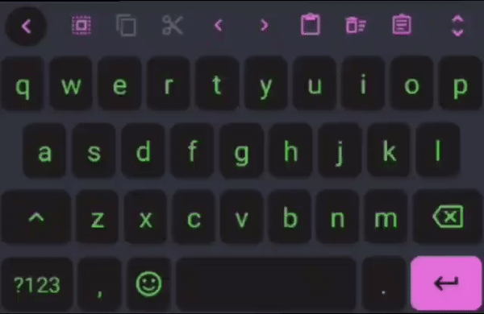

 <h2>Floris Neon</h2>
<h4>A noeon theme for Floris Board</h4>

	

## USAGE

1. Download the file ([Releases](https://github.com/shailendramaurya/floris-neon/releases/latest))
2. Open the app
3. Click on Theme
4. Click on `Manage Installed Themes`
5. Import
6. Click on `Select files`
7. Select the file in the file manager
8. It will display the theme info and click on `Import`
9. Select the flavour you want! (More themes coming soon)

## 🙋 FAQ

- **_"More about the App"_**
	- The github for the app is [here](https://github.com/florisboard/florisboard)

## How to contribute

Fork this repo, and then open a pull request

## Maintainer

[Shailendra Maurya](https://github.com/shailendramaurya)
